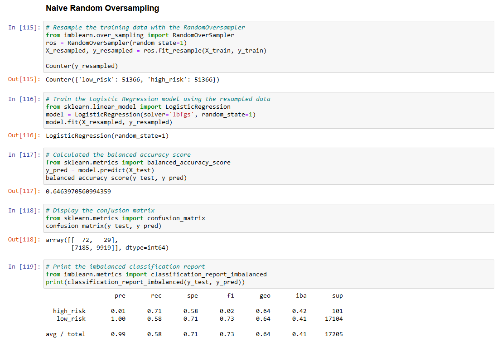
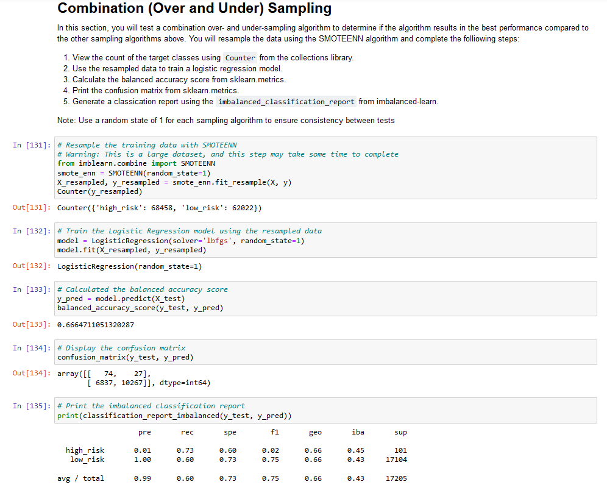

# Credit_Risk_Analysis

### Overview of the Analysis

The purpose of this analysis was to apply machine learning to solve a credit card risk by:

1. Using Resampling Models to Predict Credit Risk
2. Using the SMOTEENN Algorithm to Predict Credit Risk
3. Using Ensemble Classifiers to Predict Credit Risk

To do that, we had to:

1. Oversample the data using RandomOverSampler and SMOTE algorithms
2. Undersample the data using the ClusterCentroids algorithm
3. Implement a combinational approach using the SMOTEENN algorithm
4. Compare BalancedRandomForestClassifier and EasyEnsembleClassifier, which reduce bias

### Results

1. We were able to generate a classification report by oversampling the data using the RandomOverSampler algorithm:
We achieved a result of 64.6% for the balanced accuracy test. The precision for the high_risk loan status is very low at 1%.

2. We were able to generate a classification report by oversampling the data using the SMOTE algorithm:
We achieved a result of 65.9% for the balanced accuracy test. The precision for the high_risk loan status is very low at 1%.

3. We were able to generate a classification report by undersampling the data using the ClusterCentroids algorithm:
We achieved a result of 54.4% for the balanced accuracy test. The precision for the high_risk loan status is very low at 1%.

4. We were able to generate a classification report by implementing a combinational approach using the SMOTEENN algorithm:
We achieved a result of 66.6% for the balanced accuracy test. The precision for the high_risk loan status is very low at 1%.

5. Reducing bias using the BalancedRandomForestClassifier algorithm:
We achieved a result of 78.9% for the balanced accuracy test. The precision for the high_risk loan status is still very low, but has increased to 3%.

6. Reducing bias using the EasyEnsembleClassifier algorithm:
We achieved a result of 93.2% for the balanced accuracy test. The precision for the high_risk loan status is still very low, but has increased to 9%.

### Summary

Overall, after looking at the reults, we can determine that:

1. Oversampling the data using the RandomOverSampler algorithm did not produce a good model for predicting high risk loans.

2. Oversampling the data using the SMOTE algorithm did not produce a good model for predicting high risk loans.

3. Undersampling the data using the ClusterCentroids algorithm did not produce a good model for predicting high risk loans.

4. Implementing a combinational approach using the SMOTEENN algorithm did not produce a good model for predicting high risk loans.

5. Reducing bias using the BalancedRandomForestClassifier algorithm improved the prediction for high risk loans to 3%, but it still did not produce a good model.

6. Reducing bias using the EasyEnsembleClassifier algorithm improved the prediction for high risk loans to 9%, but it still did not produce a good model.

7. We may need to consider other methods such as Bootstrapping or Boosting.

